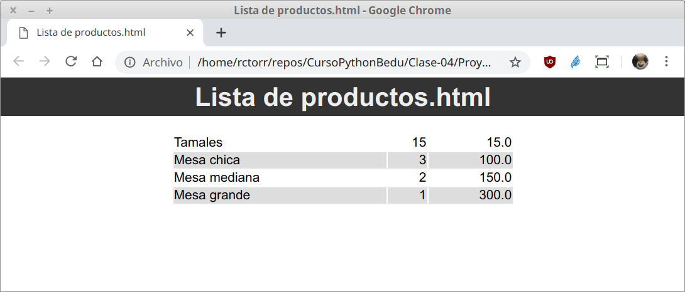
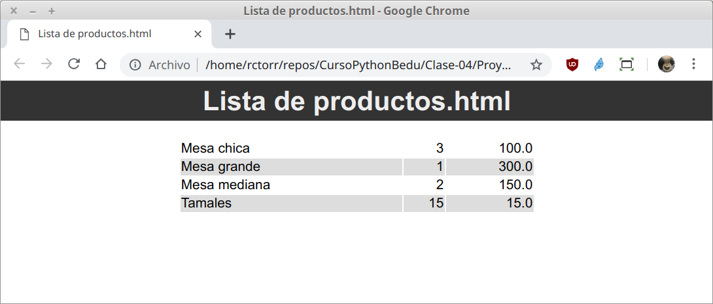

## Proyecto

### DESCRIPCIÓN

El script `csv2html.py` del _Ejemplo-03_ crean una tabla en formato HTML
con todos los registros ordenados tal como están en el archivo CSV
original.

El reto consiste en agregar la opción `-o N`, para que la tabla se imprima
de forma ordenada en base a la columna `N`.

Como un extra modifica la variable `html` para que haga uso del archivo de
estilos `main.css`.

### Resultado

Ejemplo de vista en el navegador sin orden alguno:

Ejemplo de vista en el navegador ordenando en base al nombre:

