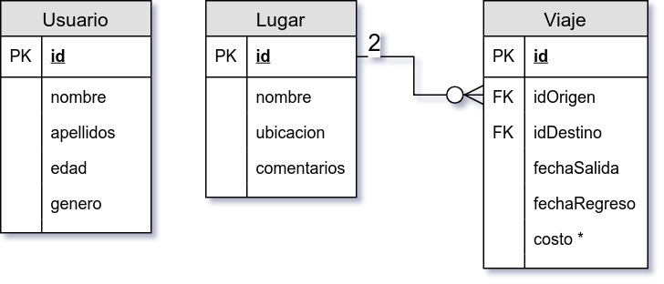
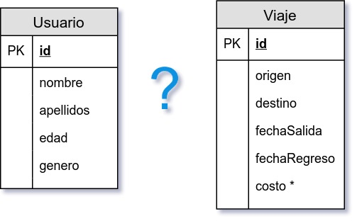

`Fullstack con Python` > [`Backend con Python`](../../Readme.md) > [`Sesión 06`](../Readme.md) > Reto-02
## Definiendo una relación muchos a muchos para proyecto BeduTravels

### OBJETIVO
Dadas dos tablas y los requerimientos de un proyecto conocer el proceso para obtener un diagrama entidad-relación normalizado de la bases de datos.

#### REQUISITOS
1. Descripción del proyecto:

   Un cliente requiere de una aplicación web que permita a un usuario buscar un destino para agendar un viaje.

   El usuario deberá poder ver una lista de los lugares más populares, así como poder ordenar o filtrar los destinos por costo.

   El usuario deberá poder ver la información del viaje y contar con la opción de poder elegir el viaje, así como ajustar algunas otras opciones del mismo.

1. Modelo de entidad-relación actual:

   

#### DESARROLLO
1. Encontrar la __cardinalidad__ entre la tabla __Usuario__ y la tabla __Viaje__ y definir el tipo de relación entre ambas tablas.

   __Pregunta__

   ¿Cuál es el tipo de relación entra la tabla __Usuario__ y la tabla __Viaje__? 

   __Respuesta__

   ???
   ***

1. Aplica el proceso de  __normalización__ a la relación muchos a muchos obtenido anteriormente:

   ???
   ***

1. Definir las relaciones entre la tercer tabla y las tablas iniciales, además también se mueven los atributos de __fechaSalida__, __fechaRegreso__ y __costo__ desde la tabla de __Viaje__.

   ???
   ***

1. El paso final es más de estrategia y consiste en reacomodar el diagrama, se recomienda colocar a la izquierda la tablas con cardinalidades fijas y a la derecha las tablas con cardinalidades muchos.

   ???
   ***
