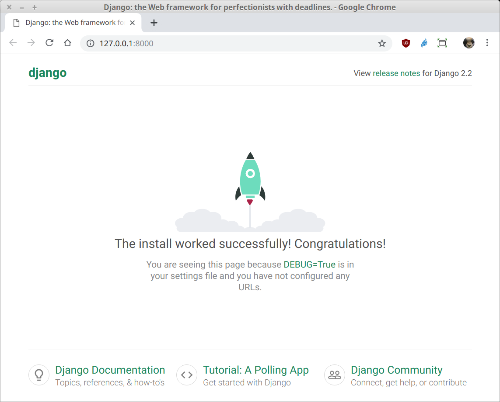
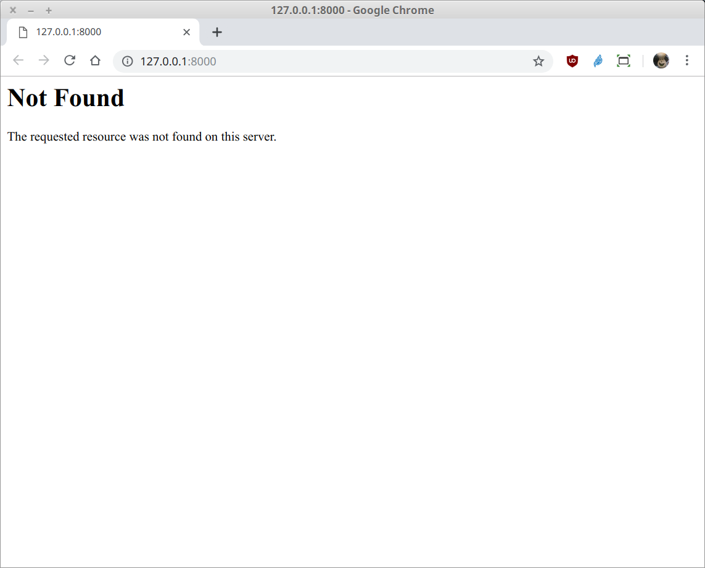

`Fullstack con Python` > [`Backend con Python`](../../Readme.md) > [`Sesión 08`](../Readme.md) > Ejemplo-02
## Realizando el "Hola mundo!" con Django

### OBJETIVOS
- Conocer como inicializar un proyecto con Django
- Conocer como ejecutar un proyecto con Django
- Conociendo la estructura de directorios de un proyecto en Django
- Conociendo la variable DEBUG

#### REQUISITOS
1. Actualizar repositorio
1. Usar la carpeta de trabajo `Clase-08/Ejemplo-02`
1. Activar el entorno virtual __Biblioteca__

#### DESARROLLO
1. Crear el proyecto __hola__ usando el siguiente comando de Django:

   ```console
   (Biblioteca) Clase-08/Ejemplo-02 $ django-admin startproject hola

   (Biblioteca) Clase-08/Ejemplo-02 $ tree
   .
   ├── hola
   │   ├── hola
   │   │   ├── __init__.py
   │   │   ├── settings.py
   │   │   ├── urls.py
   │   │   └── wsgi.py
   │   └── manage.py
   ├── Readme.md
   └── requeriments.txt

   2 directories, 7 files

   (Biblioteca) Clase-08/Ejemplo-02 $    
   ```

   __Nota:__ Comentar la lista de archivos y directorios por si no queda claro el doble `hola`, `hola`.
   ***

1. Ejecutar un proyecto con Django

   __Cambiarse a la carpeta `Clase-08/Ejemplo-02/hola`:__

   ```console
   (Biblioteca) Clase-08/Ejemplo-02 $ cd hola
   (Biblioteca) Clase-08/Ejemplo-02/hola $
   ```

   __Iniciar el proyecto en Django con:__

   ```console
   (Biblioteca) Clase-08/Ejemplo-02/hola $ python manage.py runserver
   ```

   Abrir la dirección siguiente dirección en el navegador:

   http://127.0.0.1:8000/

   __El resultado debería de ser el siguiente:__

   
   ***

1. Primera configuración para puesta en producción

   __Cambiar el valor de la variable DEBUG a False:__

   Modificar el archivo `hola/hola/settings.py` en la línea 26 y cambiar el valor de `True` a `False`.

   Observar el resultado en la ventana donde se ejecuta Django:

   ```console
   [...]
   Starting development server at http://127.0.0.1:8000/
   Quit the server with CONTROL-C.
   /home/rctorr/repos/Curso-Python-Expert/Clase-08/Ejemplo-02/hola/hola/settings.py changed, reloading.
   CommandError: You must set settings.ALLOWED_HOSTS if DEBUG is False.
   (Biblioteca) Clase-08/Ejemplo-02/hola $
   ```
   El error nos indica que si DEBUG es False, también tenemos que agregar un valor a la variable ALLOWED_HOSTS.

   __Cambiar el valor de la varibal ALLOWED_HOSTS:__

   Modificar el archivo `hola/hola/settings.py` en la línea 28 quedando de la siguiente manera:

   ```python
   ALLOWED_HOSTS = ["127.0.0.1"]
   ```

   Ejecutar nuevamente Django, porque debido al error se detuvo, luego entonces actualizar la página en el navegador que debería de obtener el siguiente resultado:

   

   Pero como vamos a estar en desarrollo lo mejor es dejar el archivo `settings.py` con DEBUG=True:

   ```python
   # SECURITY WARNING: don't run with debug turned on in production!
   DEBUG = True

   ALLOWED_HOSTS = []
   ```
   ***
