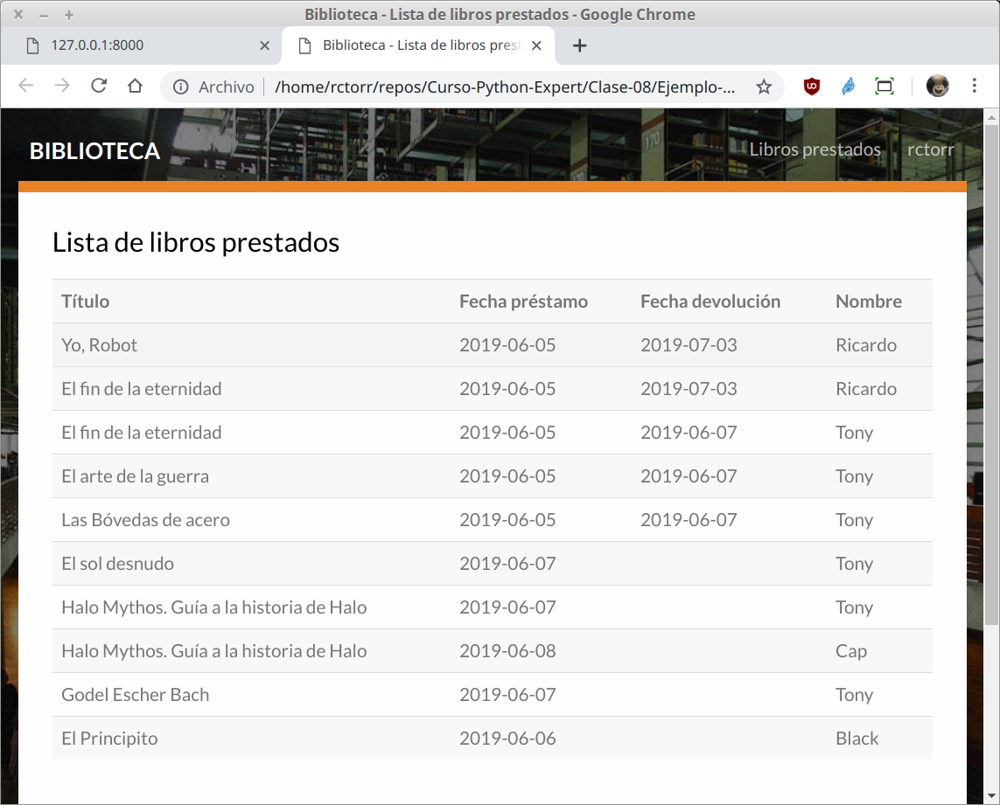
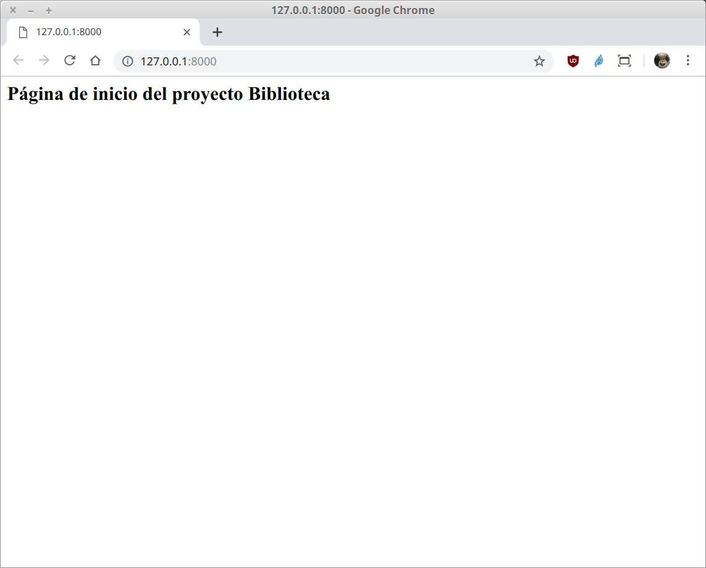
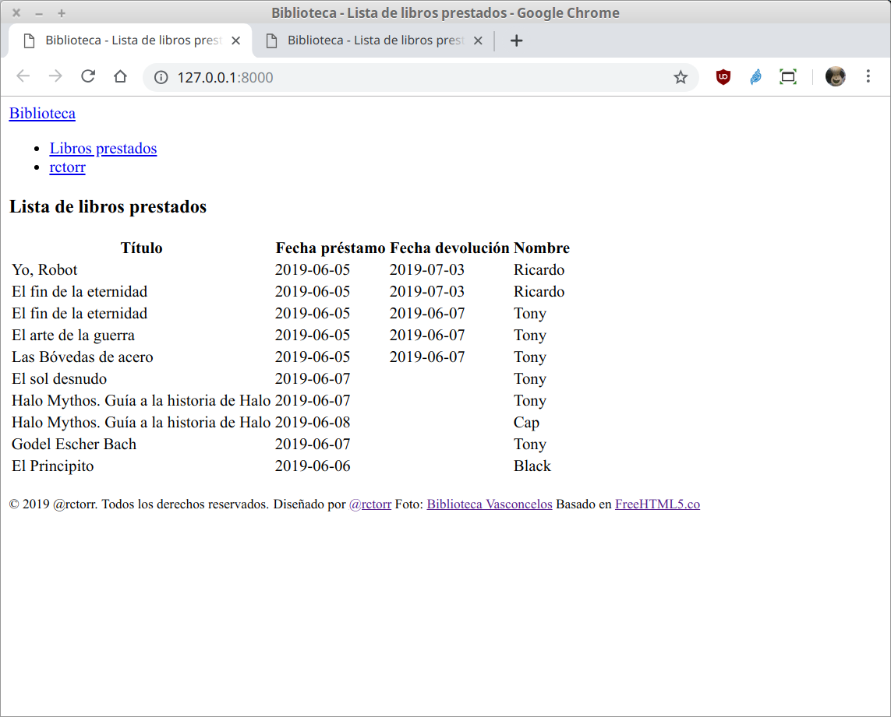

`Fullstack con Python` > [`Backend con Python`](../../Readme.md) > [`Sesión 08`](../Readme.md) > Ejemplo-03
## Iniciar la construcción de una aplicación web con Django

### OBJETIVOS
- Conocer como inicializar una app en un proyecto con Django
- Conocer y definir una rutas en Django
- Conocer y definir una vista en Django
- Conocer y definir una plantilla en Django

#### REQUISITOS
1. Actualizar repositorio
1. Usar la carpeta de trabajo `Clase-08/Ejemplo-03`
1. Activar el entorno virtual __Biblioteca__
1. Página de inicio maquetada

   

#### DESARROLLO
1. Crear el proyecto __Biblioteca__ usando el siguiente comando de Django:

   ```console
   (Biblioteca) Clase-08/Ejemplo-03 $ django-admin startproject Biblioteca

   (Biblioteca) Clase-08/Ejemplo-03 $ tree
   .
   ├── Biblioteca
   │   ├── Biblioteca
   │   │   ├── __init__.py
   │   │   ├── settings.py
   │   │   ├── urls.py
   │   │   └── wsgi.py
   │   └── manage.py
   ├── Readme.md
   └── requeriments.txt

   2 directories, 7 files

   (Biblioteca) Clase-08/Ejemplo-03 $    
   ```
   ***

1. Crear la aplicación __catalogo__ usando el siguiente comando de Django:

   __Cambiarse a la carpeta `Clase-08/Ejemplo-03/Biblioteca`:__

   ```console
   (Biblioteca) Clase-08/Ejemplo-03 $ cd Biblioteca

   (Biblioteca) Clase-08/Ejemplo-03/Biblioteca $
   ```

   __Crear la app con el comando:__

   ```console
   (Biblioteca) Clase-08/Ejemplo-03/Biblioteca $ python manage.py startapp catalogo

   (Biblioteca) Clase-08/Ejemplo-03/Biblioteca $ tree
   .
   ├── Biblioteca
   │   ├── __init__.py
   │   ├── settings.py
   │   ├── urls.py
   │   └── wsgi.py
   ├── catalogo
   │   ├── admin.py
   │   ├── apps.py
   │   ├── __init__.py
   │   ├── migrations
   │   │   └── __init__.py
   │   ├── models.py
   │   ├── tests.py
   │   └── views.py
   └── manage.py

   4 directories, 14 files
   ```
   ***

1. Ahora a mapear la url `/` hacia nuestra vista `index` en nuestra aplicación `catalogo`, recordar que Django no da acceso a nada hasta que se defina de forma explícita.

   __Revisar el flujo de una petición HTTP para el caso de Django:__

   [Ver diapos]

   __Abrir el archiv `Biblioteca/Biblioteca/urls.py` y agregar lo siguiente:__

   ```python
   from django.contrib import admin
   from django.urls import path, include  # modificada

   urlpatterns = [
       path('', include("catalogo.urls")),  # agregada
       path('admin/', admin.site.urls),
   ]
   ```

   __Si tenemos iniciado Django o lo inciamos en este momento vamos a obtener el siguiente mensaje:__

   ```console
   (Biblioteca) Clase-08/Ejemplo-03/hola $ python manage.py runserver
   [...]
   return _bootstrap._gcd_import(name[level:], package, level)
   File "<frozen importlib._bootstrap>", line 1006, in _gcd_import
   File "<frozen importlib._bootstrap>", line 983, in _find_and_load
   File "<frozen importlib._bootstrap>", line 965, in _find_and_load_unlocked
   ModuleNotFoundError: No module named 'catalogo.urls'
   ```
   Lo que indica que nos falta crear el archivo `urls.py` dentro de la carpeta `catalogo`

   __Se crea el archivo `catalogo/urls.py` con el siguiente contenido:__

   ```python
   from django.urls import path
   from . import views

   urlpatterns = [
       path('', views.index, name='index'),
   ]
   ```

   __Reiniciar Django para observar el resultado:__

   ```console
   [...]
   File "/home/rctorr/repos/Curso-Python-Expert/Clase-08/Ejemplo-03/Biblioteca/catalogo/urls.py", line 5, in <module>
     path('', views.index, name='index'),
   AttributeError: module 'catalogo.views' has no attribute 'index'
   ```
   Lo que indica que en el archivo `catalogo/views.py` no existe una función llamada `index`, así que toca agregar dicha función.

   __Agregar la función/vista `index` al archivo `catalogo/views.py`:__

   ```python
   from django.http import HttpResponse
   from django.shortcuts import render

   # Create your views here.
   def index(request):
       """ Vista para atender la petición de la url / """
       return HttpResponse("<h2>Página de inicio del proyecto Biblioteca</h2>")
   ```

   __Nota: Si la aplicación Django no está iniciada, iniciarla en este momento y abrir la siguiente url en el navegador__

   http://127.0.0.1:8000

   __El resultado debería ser el siguiente:__

   
   ***

1. Haciendo uso de las plantillas de Django integrar la página de inicio maquetada en la carpeta `public_html`.

   __Crear la carpeta `templates/catalogo` dentro de la carpeta `Biblioteca`:__

   ```console
   Clase-08/Ejemplo-03/Biblioteca $ mkdir templates
   Clase-08/Ejemplo-03/Biblioteca $ mkdir templates/catalogo
   ```

   __Copiar el archivo `public_html/index.html` dentro de la carpeta `templates/catalogo`:__

   ```console
   Clase-08/Ejemplo-03/Biblioteca $ cp ../public_html/index.html templates/

   Clase-08/Ejemplo-03/Biblioteca $ tree templates/
   templates/
   └── catalogo
       └── index.html
   ```

   __Modificar la función `index()` en el archivo `catalogo/views.py` para hacer uso de las plantillas / templates__

   ```python
   from django.shortcuts import render

   # Create your views here.
   def index(request):
       """ Vista para atender la petición de la url / """
       return render(request, "catalogo/index.html")
   ```

   __Finalmente modificar el archivo `settings.py` para indicarle a Django donde están las plantillas:__

   ```python
   [...]
   TEMPLATES = [
       {
           'BACKEND': 'django.template.backends.django.DjangoTemplates',
           'DIRS': [os.path.join(BASE_DIR, "templates")],
           'APP_DIRS': True,
   [...]
   ```

   __El resultado en el navegador debería de ser el siguiente:__

   
   ***

1. Agregando los archivos estáticos

   __Crear la carpeta `static` dentro de la carpeta `Biblioteca`:__

   ```console
   Clase-08/Ejemplo-03/Biblioteca $ mkdir static
   ```

   Y copiar en ella las carpetas `css`, `fonts`, `images` y `js` quedando de la siguiente forma:

   ```console
   Clase-08/Ejemplo-03/Biblioteca $ tree static
   static/
   ├── css
   ├── fonts
   │   ├── bootstrap
   │   ├── icomoon
   │   └── themify-icons
   ├── images
   └── js
   ```

   __Ahora se actualiza el archivo `settings.py` para indicarle a Django donde escontrar los archivos estáticos:

   ```python
   # Static files (CSS, JavaScript, Images)
   # https://docs.djangoproject.com/en/2.2/howto/static-files/

   STATIC_URL = '/static/'
   STATIC_ROOT = os.path.join(BASE_DIR, "static")
   ```

   __También hay que adicionar una ruta para que el html pueda encontrar los archivos estáticos:__

   En el archivo `Biblioteca/Biblioteca/urls.py` se agrega lo siguiente:

   ```python

   ```
