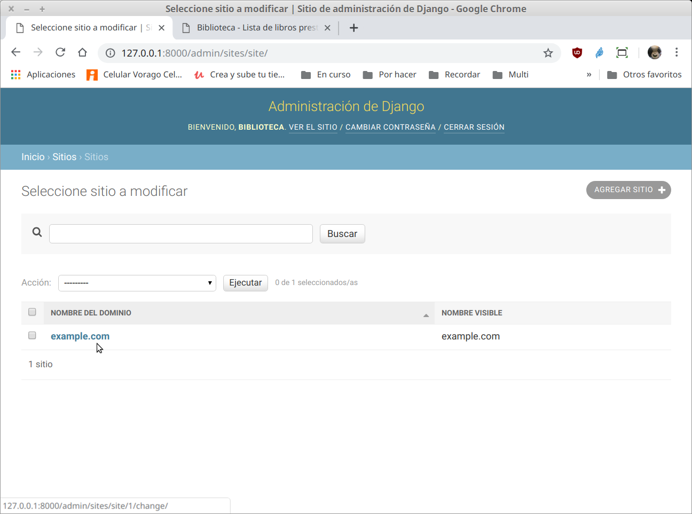
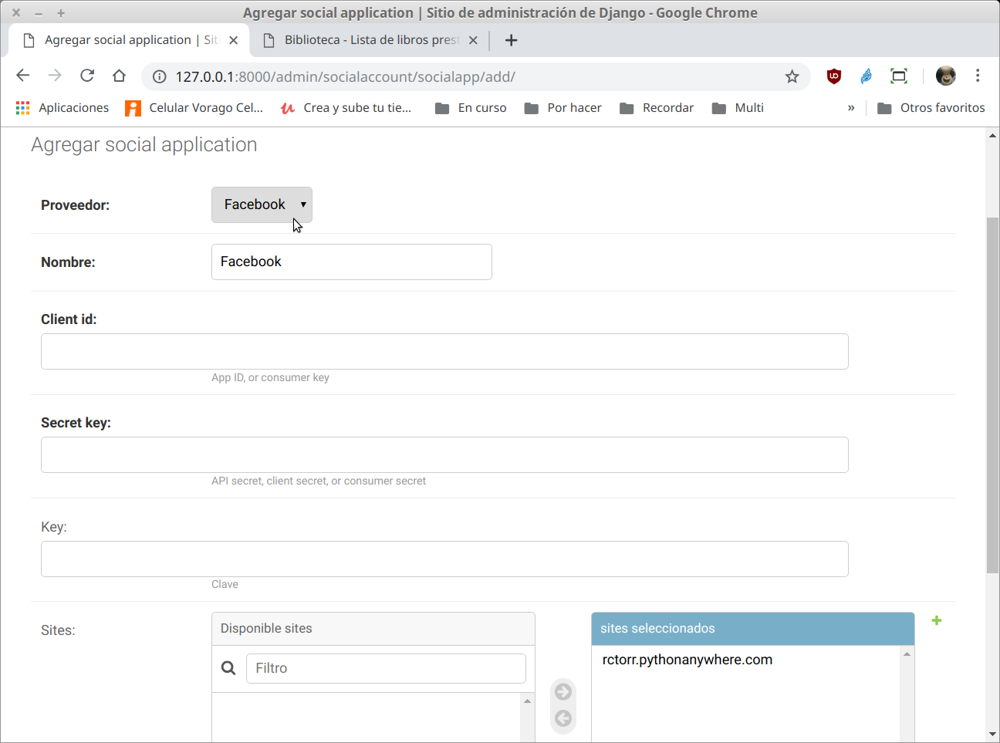
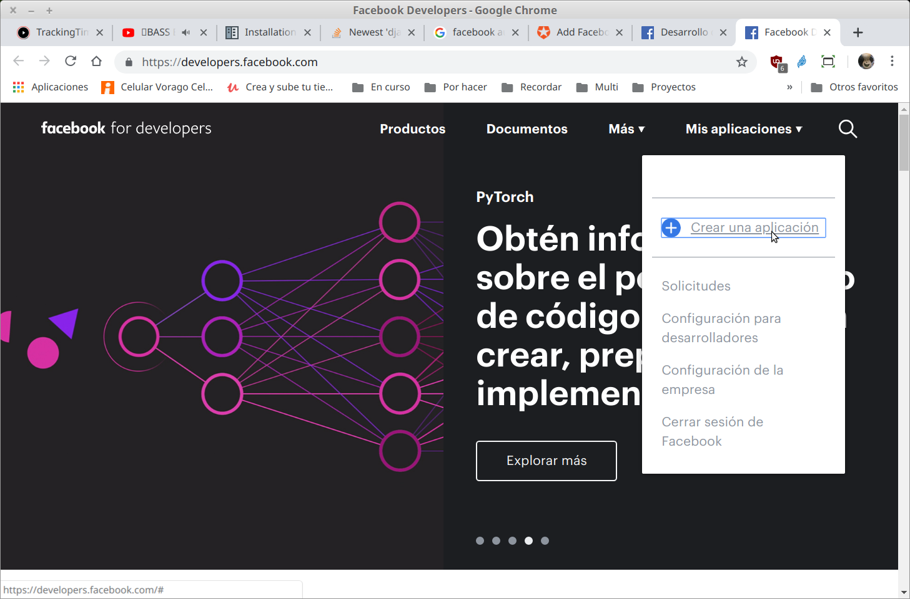
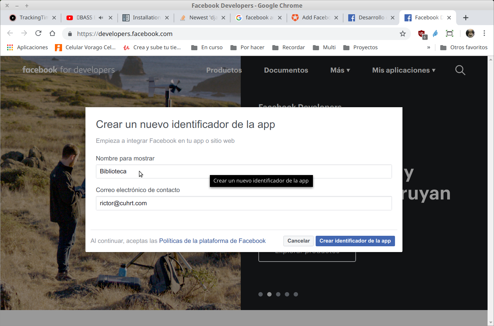
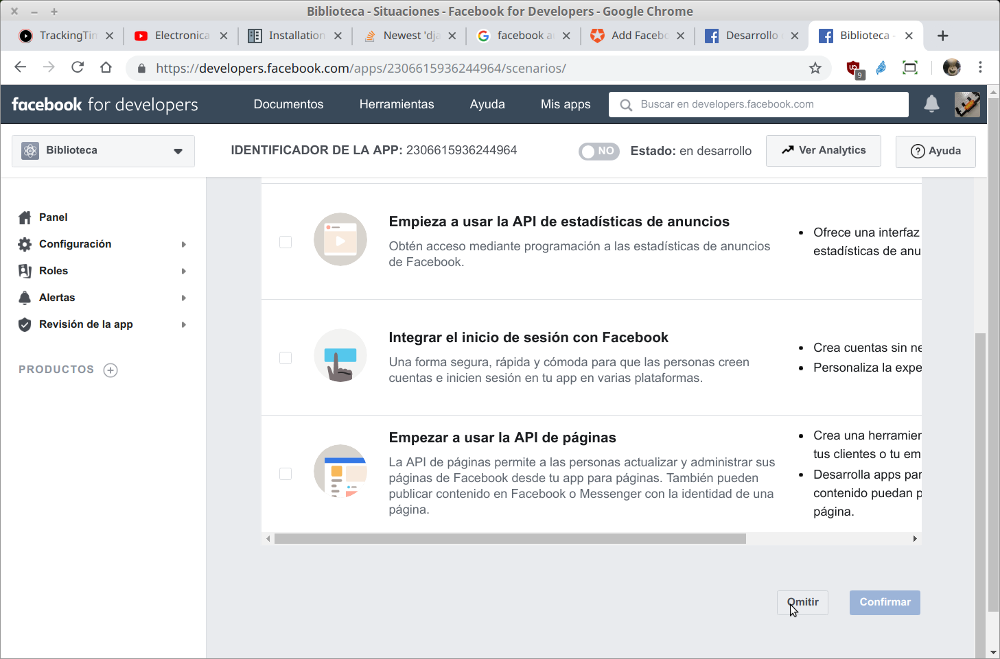

`Fullstack con Python` > [`Backend con Python`](../../Readme.md) > [`Sesión 12`](../Readme.md) > Ejemplo-01
## Sistema de registro de usuarios completo

### OBJETIVOS
- Integrar un módulo al proyecto para agregar el registro de usuarios

### REQUISITOS
1. Actualizar repositorio
1. Usar la carpeta de trabajo `Biblioteca/`
1. Activar el entorno __Biblioteca__

### DESARROLLO
1. Buscar un módulo que se adapte lo más posible a nuestras necesidades, en este caso se ha elegido el módulo:

   https://pypi.org/project/django-allauth

   Que además está actualizado hasta el 28 de febrero del 2019, aunque su repo dice que el 25 de abril, así que es un proyecto activio.

   Al usar un módulo de terceros, se busca el repo e información de documentación, en este caso en la misma página de pypi están los enlaces:

   - Sitio principal: https://www.intenct.nl/projects/django-allauth
   - Repo: https://github.com/pennersr/django-allauth
   - Documentación: https://django-allauth.readthedocs.io/en/latest
   - En stackoverflow: https://stackoverflow.com/questions/tagged/django-allauth
   ***

1. __INSTALACIÓN__ Por medio de `pip`:

   ```console
   (Biblioteca) Biblioteca $ pip install django-allauth
   Collecting django-allauth
   Requirement already satisfied: Django>=1.11 in /home/rctorr/miniconda3/envs/Biblioteca/lib/python3.7/site-packages (from django-allauth) (2.2.2)
   [...]
   Installing collected packages: defusedxml, python3-openid, urllib3, idna, chardet, requests, oauthlib, requests-oauthlib, django-allauth
   Successfully installed chardet-3.0.4 defusedxml-0.6.0 django-allauth-0.39.1 idna-2.8 oauthlib-3.0.2 python3-openid-3.1.0 requests-2.22.0 requests-oauthlib-1.2.0 urllib3-1.25.3

   (Biblioteca) Biblioteca $ pip freeze > requeriments.txt  
   ```
   No olvidar actualizar `requeriments.txt`.

1. Modificaciones en el archivo `settings.py`

   __Se agrega la sección AUTHENTICATION_BACKENDS__
   ```python
   # Necesario para allauth
   AUTHENTICATION_BACKENDS = (
       # Needed to login by username in Django admin, regardless of `allauth`
       'django.contrib.auth.backends.ModelBackend',

       # `allauth` specific authentication methods, such as login by e-mail
       'allauth.account.auth_backends.AuthenticationBackend',
   )
   ```

   __En la sección INSTALLED_APPS se agregan según necesidades del pryecto:__
   ```python
   # Necesario para allauth
   'django.contrib.sites',

   'allauth',
   'allauth.account',
   'allauth.socialaccount',
   # Sólo queremos activar la validación de las siguientes
   # redes sociales ...
   'allauth.socialaccount.providers.facebook',
   'allauth.socialaccount.providers.github',
   'allauth.socialaccount.providers.google',
   'allauth.socialaccount.providers.instagram',
   'allauth.socialaccount.providers.linkedin',
   'allauth.socialaccount.providers.linkedin_oauth2',
   'allauth.socialaccount.providers.twitter',
   ```

   __Se necesita un identificardor para el sitio creado con django:__
   ```python
   # Necesario para allauth
   SITE_ID = 1
   ```
   ***

1. Modificaciones en el archivo `Biblioteca/Biblioteca/urls.py`

   ```python
   urlpatterns = [
       path("", include("catalogo.urls")),
       path('admin/', admin.site.urls),
       path('accounts/', include('allauth.urls')),
   ]
   ```
   ***

1. Se actualiza la base de datos debido a la nueva aplicación __allauth__

   ```console
   (Biblioteca) Biblioteca $ python manage.py migrate
   Operations to perform:
     Apply all migrations: account, admin, auth, catalogo, contenttypes, sessions, sites, socialaccount
   Running migrations:
     Applying account.0001_initial... OK
     Applying account.0002_email_max_length... OK
     Applying sites.0001_initial... OK
     Applying sites.0002_alter_domain_unique... OK
     Applying socialaccount.0001_initial... OK
     Applying socialaccount.0002_token_max_lengths... OK
     Applying socialaccount.0003_extra_data_default_dict... OK

   (Biblioteca) Biblioteca $ python manage.py runserver
   Watching for file changes with StatReloader
   Performing system checks...

   System check identified no issues (0 silenced).
   July 08, 2019 - 14:57:46
   Django version 2.2.2, using settings 'Biblioteca.settings'
   Starting development server at http://127.0.0.1:8000/
   Quit the server with CONTROL-C.   
   ```
   Se inicia el servidor al final.
   ***

1. Configuration post instalación

   __Entrar al administrador de django y agregar un registro a `Site` para nuestro dominio:__

   
   Obervar que ya aparecen nuevos modelos gracias al módulo __allauth__

   
   Como ya existe un sitio con el `id=1` no se agrega uno nuevo, se modifica el existente.

  
  Usar su propio dominio, en este caso puede ser el de PythonAnyWhere, pero puede ser cualquier otro dominio.

  __Agregando autenticación por medio de facebook__

  

  
  Se elije la red social, se asigna un nombre, pero los datos faltantes no los tenemos, así que tenemos que ir a facebook para obtenerlos.

  __Obteniendo datos para nuestra aplicación en facebook__

  Abrir la url `https://developers.facebook.com` y crear una nueva aplicación

  

  
  El nombre de la aplicación es el que le aparecerá a los usuarios cuando se quieran conectar usando esta red social.

  
  
